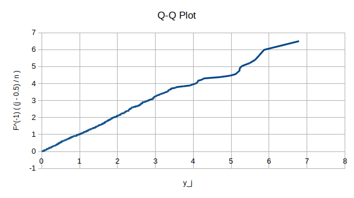
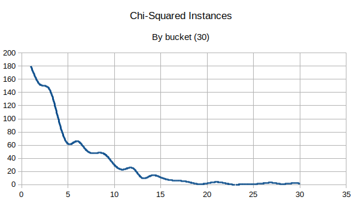
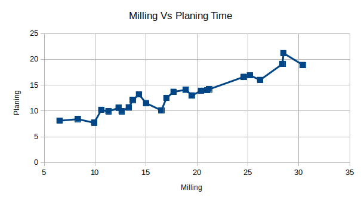
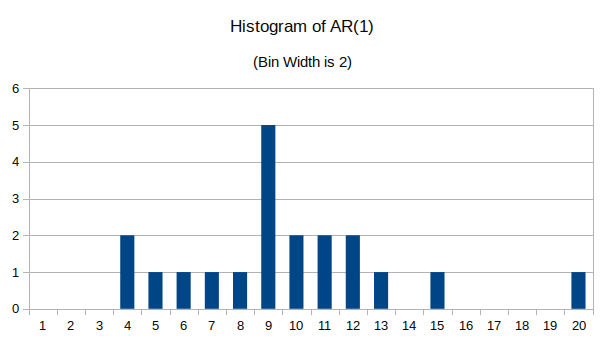

## Question 1

## Q1.a

Let $n=1$, $F^{-1}(\rho,\lambda) = \frac{-\ln(1.0-\rho)}{ \lambda }$.

\


The line is approximately straight and has an approximate slope of 1. Therefore accept it.

## Q1.b

The mean is calculated with $\bar X = \frac{ \sum_{i=1}^{n} X_i }{ n }$.

```rust
let mean = values.iter().fold(0f64,|acc, &(expo, _)| acc + expo) / SAMPLES as f64;
```

The variance is calculated with $S^2 = \frac{ \sum_{i=1}^n X_i^2 - n\bar X^2 }{ n - 1 }$.

```rust
let variance = (values.iter().fold(0f64,|acc, &(expo, _)| {
    acc + expo.powf(2.0)
}) - (SAMPLES as f64 * mean.powf(2.0))) / (SAMPLES -1) as f64;
```

$$ \bar X = \frac{ \sum_{i=1}^{n} X_i }{ n } = 0.9614169978283242 $$

$$ S^2 = \frac{ \sum_{i=1}^n X_i^2 - n\bar X^2 }{ n - 1 } = 0.9162704872993767 $$

## Q1.c

Since the sample size is $>100$ it's appropriate to use $n^{\frac{1}{2}}$ or $\frac{n}{5}$ as $k$.

The largest value $v = k-s-1$ on the table with appropriate precision is $k=30, v=28$. $n^{\frac{1}{2}} \approx 30$.

\


<!-- TODO -->

# Question 2

## Q2.a

Using $E_i = n*p(x) = n\frac{e^{-\alpha} \alpha^x}{x!}$ where $\alpha=?$.

Since we don't know $\alpha$ we must estimate the parameter, $\hat \alpha = \bar X = \frac{ \sum_{j=1}^c f_jm_j }{n}$

$$ \bar X = \frac{ \sum_{j=1}^c f_jm_j }{n} = \frac{ 0.5*35 + 1*40 + 2*13 + 3*6 + 5*1 + 6*1 }{ 7 } = 16 $$

Which doesn't make sense.

<!-- TODO -->

## Q2.b

Using $E_i = n*p(x) = n\frac{e^{-\alpha} \alpha^x}{x!}$ where $\alpha=1$.

| $x_i$ | $O_i$ | $E_i$ | $\frac{(O_i - E_i)^2}{E_i}$ |
|-------|-------|-------|-----------------------------|
| 0     | 35    | 2.5   | |
| 1     | 40    | 2.5   | |
| 2     | 13    | 1.28  | |
| 3     | 6     | 0.42  | |
| 4     | 4     | 0.10  | |
| 5     | 1     | 0.02  | |
| 6     | 1     | 0.003 | |

Which also makes no sense.

<!-- TODO -->

## Q2.c

<!-- TODO -->

# Question 3

## Q3.a

\


Sure, they seem somewhat dependent.

## Q3.b

* Assuming $\mu_1, \mu_2$ are "mean". Assuming $E(X_1X_2) = E(X_1 * X_2)$. (Neither specified anywhere in slides.)
* Assuming $\sigma_1, \sigma_2$ are standard deviations. (Not specified in slides.)

$$ cov(X_1, X_2) = E(X_1X_2) - \mu_1\mu_2 $$

$$ \mu_1 = 17.732 $$
$$ \mu_2 = 13.06 $$
$$ E(X_1X_2) = 253.5168 $$

$$ cov(X_1, X_2) = 253.5168 - 17.732*13.06 = 21.9 $$


$$ \sigma_1 = 6.7111052244 $$
$$ \sigma_2 = 3.5614837732 $$

$$ \rho = corr(X_1, X_2) = \frac{ cov(X_1, X_2) }{ \sigma_1 \sigma_2 } = \frac{21.9}{ 6.7111052244 * 3.5614837732 } = 0.916 $$

Therefore there is a strong linear relationship.

## Q3.c

* The assignment clearly says "Just write the method" so that is what is being done.

1. Generate $Z_1$ and $Z_2$, two independent standard normal random variables.
2. Set $X_1 = \mu_1 + \sigma_1Z_1$
3. Set $X_2 = \mu_2 + \sigma_2(\rho Z_1 + Z_2\sqrt{1-\rho^2})$

# Question 4

* Noting that is question is not particularly well specified, the slides use inconsistent variable naming, and reference non-existing variables, doing my best.

### AR(1)

Setting $h=1$, $\bar X = 20.05$, $\hat \sigma^2 = 15.4184210526$.

To estimate lag-1autocorrelation:

$$ \sum_{j=1}^19 X_t X_{t-1} = 7760 $$

Thus $cov = \frac{ 7760 - (20-1)(20.05)^2 }{ (20-1) } = 6.4$

$$ \hat \phi = \frac{ cov(X_t, X_{t+1}) }{ \sigma^2 } = \frac{6.4}{15.418} = 0.41509 $$

$$ \hat \sigma_\epsilon^2 = \sigma^2(1-\hat \phi^2) =  15.4184210526(1-0.41509) = 9.018 $$

$$ \frac{ \sigma_\epsilon^2 }{ 1 - \phi^2 } = \frac{9.018}{ 1- 0.41509^2} = 10.89 $$

The generated $X_t$ values from OO Calc:

```
21.1480155287
36.4961264149
27.6268298019
16.5775094453
19.8257462061
14.8937771974
21.0894675385
4.0570092002
10.3942861154
18.7841970171
24.6828897296
12.6711106906
6.149090544
4.3991214352
14.4739414845
15.7183889705
17.3638744152
14.2635837215
15.5599657764
8.6487910021

```

\


### EAR(1)

Setting $h=1$, $\bar X = 20.05$, $\hat \sigma^2 = 15.4184210526$.

To estimate lag-1autocorrelation:

$$ \sum_{j=1}^19 X_t X_{t-1} = 7760 $$

Thus $cov = \frac{ 7760 - (20-1)(20.05)^2 }{ (20-1) } = 6.4$

$$ \hat \phi = \hat \rho = \frac{ 6.4 }{ 15.4 } = 0.41 $$

$$ \hat \lambda = \frac{1}{20.05} $$

<!-- TODO -->

# Question 5

* Question does not specify **which** Single Server System to use, so using the one from A2 which already calculates the delay.

Since the new mean service time is 2 and $\rho = \frac{ \lambda }{ \mu }$ then average Interarrival = 2.857.

|Seed | w       |
|-----|---------|
|1    | 7.08269 |
|2    | 7.81672 |
|3    | 6.12031 |
|4    | 6.43309 |
|5    | 6.29581 |
|6    | 6.17629 |
|7    | 6.56624 |
|8    | 6.50348 |
|9    | 6.32141 |
|10   | 6.58256 |

## Q5.a

The point estimator is

$$ \hat \theta = \frac{1}{n} \sum_{i=1}^n Y_i = 6.58986 $$

The confidence-interval estimation is

$$\bar Y_{..} \pm t_{\alpha / 2, R-1} \frac{S}{\sqrt{R}} \text{ where } t_{\alpha / 2, R-1} \text{ is the quantile of the t-distribution.} $$

Noting:

* $S^2 = \frac{1}{R-1} \sum_{i=1}^R (Y_{i.} - Y_{..})^2$ is the sample variance.
* $\bar Y_{..} = \sum_{i=1}^R \frac{Y_{i.}}{R}$ where $R$ is the number of independent replications.
* Using periods to notate subscripts is a pretty devious syntax use and should be discouraged. It's basically impossible to tell if they are being used for one thing or another. Like $p$ and $\rho$.

$$ \bar Y_{..} = \sum_{i=1}^R \frac{Y_{i.}}{R} = 6.58986 $$

$$ S = \frac{1}{R-1} \sum_{i=1}^R (Y_{i.} - Y_{..})^2 = \sqrt{ \frac{1}{10-1} * 2.3307645526 } = 0.5088947 $$

$$ \bar Y_{..} \pm t_{\alpha / 2, R-1} \frac{S}{\sqrt{R}} = 6.58986 \pm 1.83 * \frac{0.5088947}{\sqrt{10}} = 6.58986 \pm 0.29449 $$

The prediction interval is:

$$ Y_.. \pm t_{a/2, R-1} S \sqrt{ 1 + \frac{1}{R} } = 6.58986 \pm 1.83 * 0.5088947 \sqrt{1+\frac{1}{10}} = 6.58986 \pm 0.976732 $$

## Q5.b

$$ \frac{ Z_{0.0} * 0.5088947 }{ 0.5 } = \frac{2.26^2 * 0.5088947}{0.5} = 5.19 $$

No, it isn't.

## Q5.c

The confidence interval became more "accurate", the prediction interval became smaller. Since the system is steady state, the results are reasonably similar.
